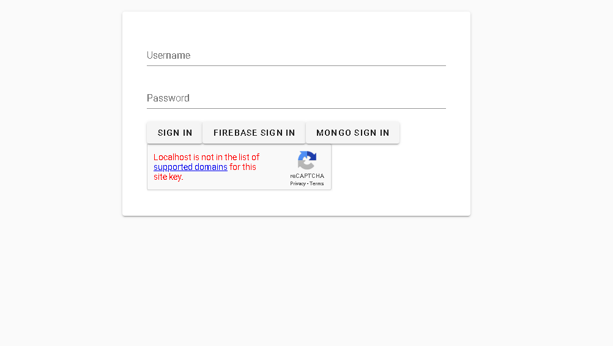
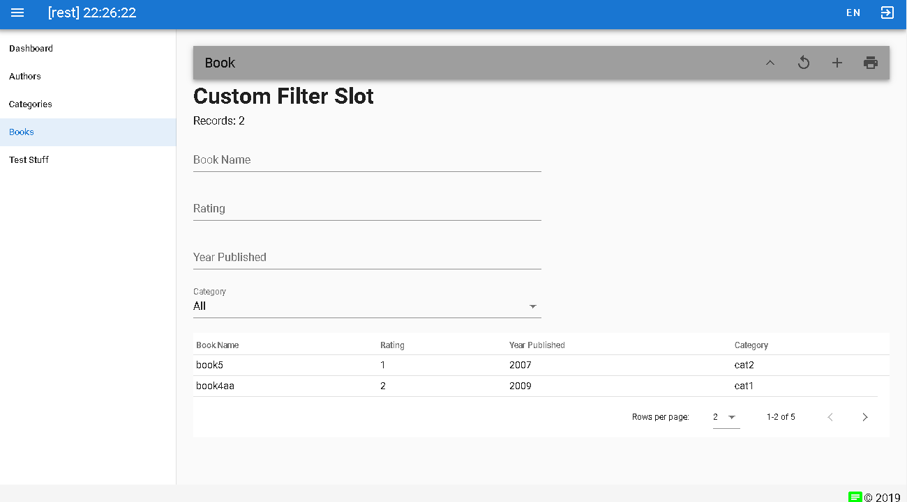
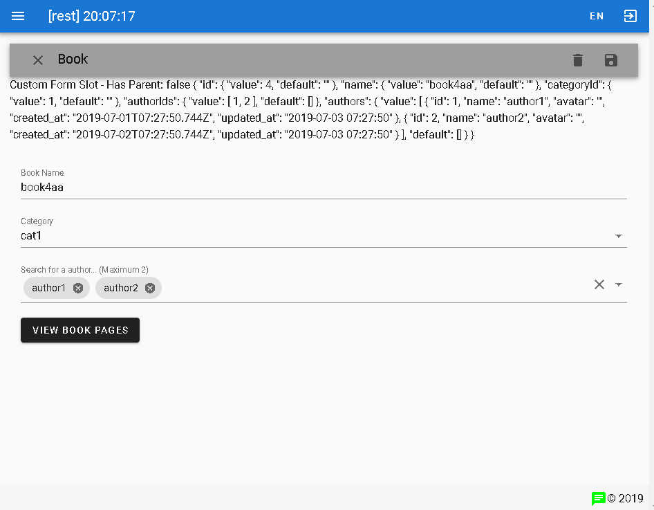
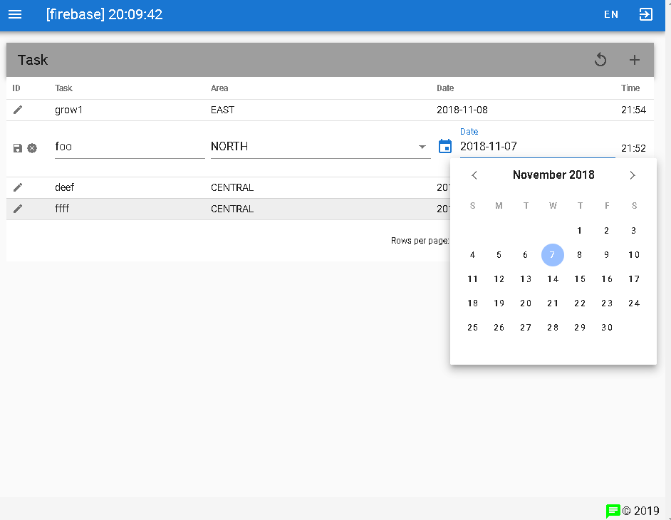

[](https://badge.fury.io/js/vue-crud-x) [](https://www.npmjs.com/package/vue-crud-x) [](https://sonarcloud.io/dashboard?id=com.lapots.breed.judge:judge-rule-engine) [](https://snyk.io/test/github/ais-one/vue-crud-x) [](https://madewithvuejs.com/p/vue-crud-x/shield-link)

**TL;DR** ExpressJS & VueJS Web App Cookbook, Customisable CRUD Library, Cloud Container Deployment

# VUE-CRUD-X - WHY & WHAT

> Writing same code each time you work on a new application? Trouble keeping the libraries updated? Many fixes when dependency version changes?

Well... what started as a CRUD component for VueJS has grown to a full-stack app development cookbook, and further expanded into a way of building and maintaining multiple full-stack applications of different use cases with as little waste as possible, aiming to address those 3 issues above as much as possible!

> A VueJS CRUD component which is customisable and extensible to suit more complex situations such as Nested CRUD, custom filters, forms, use of GraphQL or REST to access various datastores. Vuetify is used for frontend UI components but can be changed to alternatives such as ElementUI (with some effort)

> Over time, the example projects to show the use of **vue-crud-x** have grown to become a **cookbook** that includes many other useful **recipes** for use in production ExpressJS and VueJS web applications.

# NOTICES & UPDATES

Latest Version [0.3.2](https://github.com/ais-one/vue-crud-x/releases/tag/0.3.2) - Released 2020 Jul 15 1230 +8GMT

**vue-crud-x 0.3+** Reorganize folders and structure, for ease of developing and maintaining multiple applications.

**vue-crud-x 0.2+** uses Vuetify 2. Due to many breaking changes from Vuetify 1 to 2, we took the chance to make things better by designing component to be more UI framework agnostic (reduce dependencies!), easier to use, improving code quality, documentation and supporting [article](https://dev.to/aisone/vuejs-expressjs-crud-cookbook-46l0).

**vue-crud-x 0.1** and Vuetify 1 will be supported under the [v1 branch](https://github.com/ais-one/vue-crud-x/tree/v1). You can refer to the v1 [article](https://medium.com/@aaronjxz/vue-crud-x-a-highly-customisable-crud-component-using-vuejs-and-vuetify-2b1539ce2054).

## Design Considerations

> Always Remember Rule #1 - Do Not Let Technical Debt Build Up

- keep technical debt in view
- keep in mind https://12factor.net/
- scalable in terms of application use cases & traffic load
- ease of development, maintenance, updates, build, test, integration, delivery, deployment, etc.
- size, speed, modularity (e.g. micro services)
- limit number of languages (e.g. use JS for everything) and dependency usage
- go native, reduce dependency, balance use of native code vs libraries
- avoid / move away from using bundlers such as web pack, keep tooling minimal
- automated testing, ci/cd, devopsec, cloud, container orchestration

## CRUD Unique Selling Points

The following differentiates vue-crud-x from other CRUD repositories:
- Able to do nested CRUD operations (parent table call child table),
- Server side pagination, sorting & filtering
- Handle infinite scroll use-case
- Handle authentication tokens, user permissions
- Customise table, search filter, CRUD form, validation, CRUD operations (call REST, GraphQL, Firestore, etc.)
- Auto-configure/generate Search filter and CRUD Forms using JSON
- Inline edit (row level)
- Export to CSV/JSON, File/Image Upload
- Reload & optimization strategy
- Overridable methods with default behaviour
- Emitted events for use by parent component
- Real-time updates & subscription

Other design considerations :
- i18n, l10n a11y
- Tree shaking, Lazy loading, Performance
- Implementation with multiple UI frameworks
  - remove as many UI framework dependent parts as possible
  - indacate parts which should change if other UI frameworks are used 
- Cleaner code with correct use of RxJS, async/await/Promises
- Prefer static generated sites, over SSR and SPA
- Automated unit & integration test


# QUICK START - ON YOUR LOCAL MACHINE

1. Clone the repository, setup and run, using the following commands

```bash
git clone https://github.com/ais-one/vue-crud-x.git
cd vue-crud-x
npm run install-libs
npm run initdb-knex
npm run app:spa
```

**NOTE** mongodb is not run and there will be connection error for mongodb. To have mongodb use docker-compose file in docker-devenv\mongodb. Remember to do one-time initiate of replication set first.

**NOTE** the secrets folder is missing so there maybe some logs about missing files (but it is ok to ignore)

The code below is most important, setup and reading of configs, other than for the app, it is use also used in process-cron.js and process-long.js (long running process)

```js
// index.js
require(require('path').join(process.cwd(), 'common-lib', 'setup')) // first thing to setup
require(LIB_PATH + '/config') //  first thing to include from LIB_PATH
```

Navigate to http://127.0.0.1:8080 to view the VueCrudX demo and example SPA application in development

Login using the following:
- User: test
- Password: test
- OTP (if enabled): if USE_OTP set to TEST, use 111111 as otp pin

View example OpenAPI documentation at http://127.0.0.1:3000/api-docs

View website served by Express with functional samples and demos at http://127.0.0.1:3000

2. Testing

To run unit & integration test on /api/authors route

TO TEST EVERYTHING PLEASE change describe.only(...) to describe(...) in the test scripts in example-app/tests

```
npm run test
```

3. Long Running Processes and Crons

Command to run long process (do take note of caveats)

```
npm run process-long
```

Command to simulate process triggered by cron (**NOTE:** it may be better to use cron to call API rather than trigger a process)

```
npm run process-cron
```

4. To serve the VueJS SPA production build

From vue-crud-x folder

```bash
cd example-app/web/spa
npm run build
```

Change the example-app/config/index.js file contents

```js
  //...
  WEB_STATIC: [
    //...
    { folder: process.cwd() + '/spa/dist', url: '/' }, // uncomment this
    // { folder: APP_PATH + '/public/demo-express', url: '/' }, // comment this
    //...
  ]
  //...
```

5. VueJS example Nuxt SSR/Static Application

In vue-crud-x folder, run the **frontend** from one console...

```bash
cd example-web/ssr
npm i
npm run dev
```

**Note:** for static content see example-web/ssr/README.md on generating and serving static content

6. PWA and vite

Work In Progress


---

# BUILDING A NEW APPLICATION

## Initial Creation - the master branch

```bash
mkdir <my-project>
cd <my-project>
git clone --depth=1 --branch=develop https://github.com/ais-one/vue-crud-x.git
# copy required files
cp vue-crud-x/deploy.sh vue-crud-x/update.sh vue-crud-x/package.json vue-crud-x/.eslintrc.json vue-crud-x/.gitignore .
# copy required folders
mv vue-crud-x/common-lib .
# copy docker related files
cp vue-crud-x/.dockerignore vue-crud-x/Dockerfile vue-crud-x/docker-compose.yml .

# copy the example-app for use as reference (optional)
mv vue-crud-x/example-app .
# copy the example-web for use as reference (optional)
mv vue-crud-x/example-web .
# cleanup
rm -rf vue-crud-x
```

## Next Steps

- In **package.json**
  - Set application name in **config.app** property (indicate folder of your application - set to example-app if using example-app folder)
  - Set environment using **config.env** property (development, uat, staging, production)
- In **update.sh**
  - Uncomment the lines, this script is used to update the common library

```json
{
  "config": {
    "app": "example-app",
    "env": "development"
  }
}
```

## Configuration

<my-project>/example-app/config/index.js contains all the config properties.

If too many config properties, split it to other folders and files

You can override the configurations using .env.<NODE_ENV> files, e.g. .env.development or .env.production in **example-app/config/secret**


## Updating The Library

See script **update.sh**


## Deployment

The following environments

- development (used for local development)
- uat (uat deployment design can also be used for higher environments such as production)

### development environment

The development environment is on a local machine used by developers.

Docker compose can be used to set up supporting applications such as Redis, ElasticSearch, Kafka, etc.

- cloudflare - no
- frontend - local
- backend - local
- mongodb - local
- file uploads - local folder / Google object storage
- sqlite - local file
- user_session - local memory

Commands for running locally are described earlier


### uat (and also production) environment

The UAT, production and (optional staging) environments are on the service provider.

- Domain name verification
- cloudflare
  - DNS (for API, for frontend)
  - full SSL (can be self-signed at server side)
- frontend - GCP object storage, https
- backend - docker-> Google Cloud Run, https
  - OPTION deploy to GCP Group Instances (need to set load balancer and networking) [TBD]
  - OPTION deploy to GKE [TBD]
- mongodb - Mongo Atlas
- file uploads - Google object storage
- sqlite - local file (should replace with SQL DB)
- user_session - mongodb

**Manual Deployment Script**

```
npm run deploy
```

- Cloud Run backend
  - select ```deploy-cr``` to deploy backend on cloud run
    - need to set CORS on allowed frontend origin
    - if using custom domain, requires domain name, point to CNAME
- VM backend (Optional)
  - select ```deploy-vm```
  - you can use the following commands ```stop,start,list```

- Frontend
  - select ```deploy-fe``` to deploy frontend on object storage


> work needs to be done on the organise and reference the setup documentation in the docs folder


## CircleCI Deployment (Work In Progress)

TBD


---

# Project Strcuture

The project structure is shown below

```
vue-crud-x
+- common-lib/ : common components
|  +- auth/ : for express authentication
|  +- comms/ : messging
|  +- esm/ : JS that can be used by both front and backend
|  +- express/ : express related
|  +- services/ : nodejs libs
|  +- webpacked/ : webpacked components for frontend (including vue-crud-x)
|  |  +- dist/ : distribution folder for CRUD component
|  +- app.js : the express app boilerplate
|  +- config.js: the base config
|  +- setup.js: setup globals
+- docker-devenv/ : docker for development environment (e.g. run redis, mongodb from here)
|  +- mongodb
+- docs/ : documentation
+- example-app : an example backend application **Use this example for your project**
|  +- config/ : centralized config folder
|  |  +- certs/ : certificates for HTTPS and JWT signing
|  |  +- k8s/ : kubernetes YAML files (WIP)
|  |  +- secret
|  |  |  +- .env.<node_env>
|  |  |  +- <node_env>.deploy
|  |  |  +- <node_env>.pem
|  |  |  +- <node_env>.gcp.json
|  |  |  +- <node_env>.gcp.cors.json
|  |  +- index.js : home to your configs, can scale by adding folders and files
|  +- controllers/
|  +- coverage/ (auto-generated by test runner)
|  +- db/
|  |  +- migrations/
|  |  +- mongo/
|  |  +- seeds/
|  +- graphql/ : graphql stuff
|  +- jobs/ : message queue jobs
|  +- logs/
|  +- middlewares/
|  +- models/
|  +- public/ : for serving static files - website
|  |  +- demo-express/ (127.0.0.1/)
|  |  +- demo-nobundler/
|  +- router/
|  +- tests/ : Jest tests
|  +- uploads/ : for serving static files - files
|  +- ecosystem.config.js
|  +- index.js
|  +- jest.config.js: JEST testing
|  +- knexfile.js: Knex query builder
|  +- package.json
|  +- process-long.js: sample long running process
|  +- process-cron.js: sample cron triggered process
|  +- README.md
+- example-web/ : frontend associated to the application
|  +- pwa/
|  +- spa/
|  +- ssr/
|  +- vite/
|  +- <your other front end here>
+- sandbox/ : Useful scripts
+- .dockerignore
+- .eslintrc.json
+- .gitignore
+- deploy.sh
+- docker-compose.yml
+- Dockerfile
+- LICENCE
+- package.json
+- README.md
+- RELEASE.md
+- update.sh
```


## [spa](https://github.com/ais-one/vue-crud-x/tree/master/example-app/web/spa)

**Best for quick start** - Please use this to try things out. Everything runs locally

Recipes for a production-ready SPA:
- Example **vue-crud-x** usage
- REST and websockets
- Graphql (Apollo client, includes authentication, subscriptions, cache, optimistic UI, refetch queries)
- Login
  - recaptcha
  - Local Email-password login, Github login & JWT
    - optional 2FA OTP signin with Google Authenticator
      - setup with USE_OTP=GA in environement files of both the front and backend
      - Check DB seeders for the API key to use, or you can find out how to generate your own
- rxJs for cleaner code (auto-complete, debounce, fetch latest)
- Upload to cloud provider using signed URLs
- Other Features
  - Image capture via webcam
  - Signature capture on canvas

## [backend & libs](https://github.com/ais-one/vue-crud-x/tree/master/common-lib/)

Recipes for a production-ready Express server used by **example-app/web/spa** and **example-app/web/ssr**:
- ObjectionJS
  - Sample SQL DB with 1-1, 1-m, m-n use cases, transactions, migrations, seeders,
  - Supports SQLite, MySQL, MariaDB, Postgres, MSSQL
- MongoDB
  - seeders (migration not needed)
  - watch for real-time collection & document changes
- Authentication & Authorization
  - JWT (with RSA signatures) & 2FA OTP (using Google Authenticator), Refresh token, token in HttpOnly cookies
  - Local Login, OAuth2 Github Login, SAML ADFS login using Passport
- CORS, proxy middleware, helmet (securing express)
- Documentation
  - OpenAPI with JSDoc (enable for local only)
- Key-Value Store for user token storage on server (can replace with redis in production environment)
- Websocket (use https://www.websocket.org/echo.html & ngrok to test)
- GraphQL (use Apollo server)
- File uploads (to VM or to cloud storage via Signed URLs)
- Unit Test & Integration Test
- Logging
- Message queues (Bull, AgendaJS)
- No-bundler frontend demo


## [ssr](https://github.com/ais-one/vue-crud-x/tree/master/example-app/web/ssr)

Recipes for a production-ready Nuxt static sites. Static sites have the same advantages as SSR but are less complex to set up. The only thing to take care of is redirection of unknown dynamic routes:
- nuxt-auth (removed, use from example-spa instead due to... lack of refresh token, and possibly lack of httponly token capability - as at time of writing 21-11-2019)
  - Social login using Github
- nuxt-i18n (removed, the documents are more than sufficient for now)
- SSR & pre-generated Static Web App 
  - Handling of 500 and 404 errors
- Show gotchas of SSR

**IMPORTANT NOTE:** we use SSR mode, WITHOUT implementing the server side features for efficient debugging of static generated sites.

## [pwa](https://github.com/ais-one/vue-crud-x/tree/master/example-app/web/pwa)

- PWA
- Push Notifications

## [vite](https://github.com/ais-one/vue-crud-x/tree/master/example-app/web/vite)

Something new...

---

# DOCUMENTATION

**vue-crud-x** library documentation can be found in [docs/VueCrudX.md](docs/VueCrudX.md)

Roadmap and Release notes for the library and examples can be found in [Release.md](Release.md)

Documentation can be found starting at [docs/home.md](docs/home.md)

**vue-crud-x 0.2+ Article** <a href="https://dev.to/aisone/vuejs-expressjs-crud-cookbook-46l0" target="_blank">VueJS+ExpressJS CRUD & Cookbook</a>

**vue-crud-x 0.1 Article** <a href="https://medium.com/@aaronjxz/vue-crud-x-a-highly-customisable-crud-component-using-vuejs-and-vuetify-2b1539ce2054" target="_blank">Legacy Article (For Historical Reference)</a>


# SAMPLE SCREENSHOTS

## Login Screen

- recaptcha

[](./docs/images/login.png)

## Table & Filter

- filter
- pagination

[](./docs/images/table.png)

## Form

- custom form slot
- tags and lazy-load autocomplete
- click button to child table

[](./docs/images/form.png)

## Inline Edit

- inline edit
- date-picker, select and other controls

[](./docs/images/inline.png)
