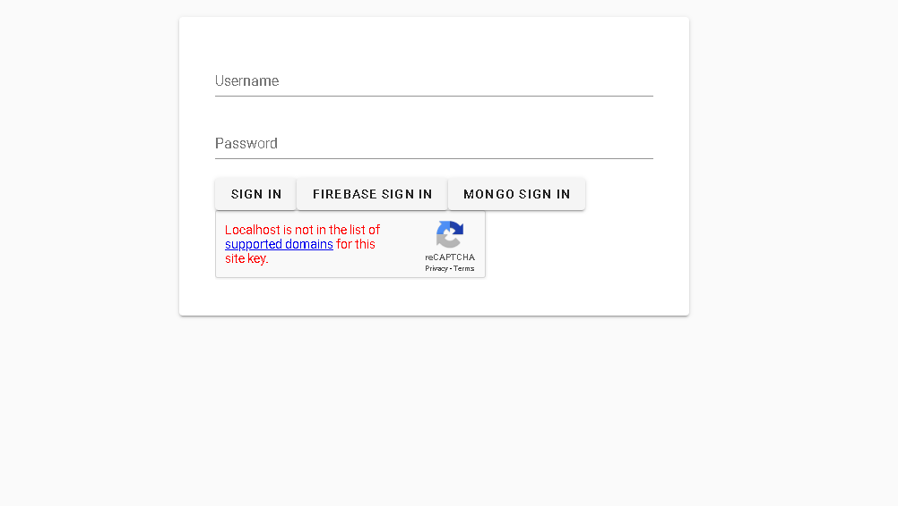
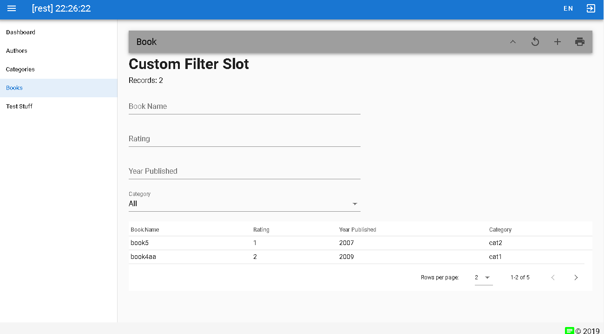
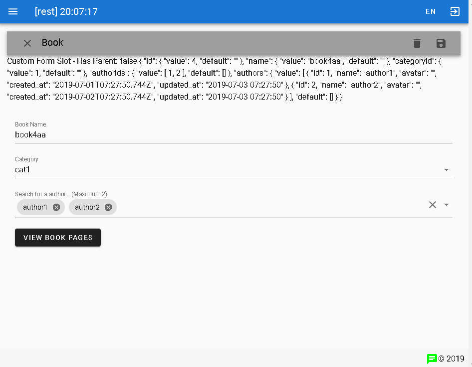
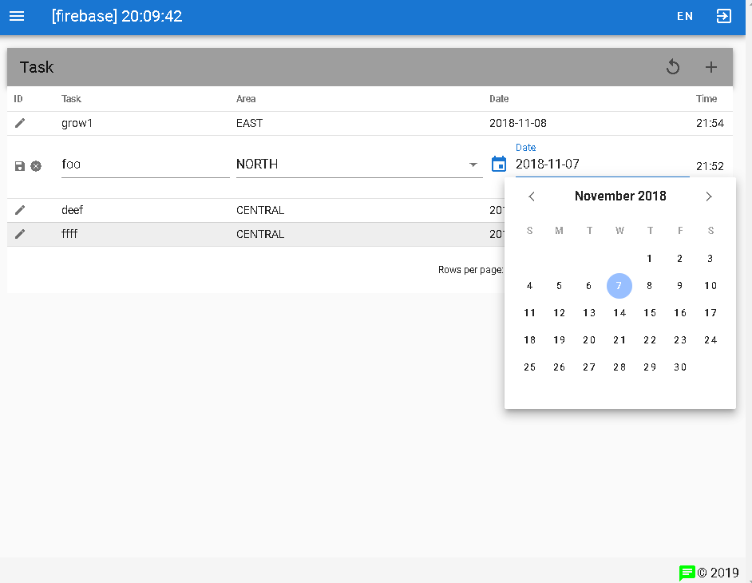

[](https://badge.fury.io/js/vue-crud-x) [](https://www.npmjs.com/package/vue-crud-x) [](https://madewithvuejs.com/p/vue-crud-x/shield-link)

# NOTICES & UPDATES

> Latest Version 0.2.1 Released 2019 August 20 0815 +8GMT
> vue-crud-x 0.1 and Vuetify 1 will be supported under the [v1 branch](https://github.com/ais-one/vue-crud-x/tree/v1)

**vue-crud-x 0.2** uses Vuetify 2. Due to many breaking changes from Vuetify 1 to 2, we took the chance to make things better by designing component to be more UI framework agnostic (reduce dependencies!), easier to use, improving code quality, documentation and supporting [article](https://dev.to/aisone/vuejs-expressjs-crud-cookbook-46l0).

# WHAT IS VUE-CRUD-X

**TL;DR** A Customisable CRUD Library And Cookbook For ExpressJS & VueJS Apps

> A VueJS CRUD component which is customisable and extensible to suit more complex situations such as Nested CRUD, custom filters, forms, use of GraphQL or REST to access various datastores. Vuetify is used for frontend UI components but can be changed to alternatives such as ElementUI (with some effort)

> Over time, the example projects to show the use of **vue-crud-x** have grown to become a **cookbook** that includes many other useful **recipes** for use in production ExpressJS and VueJS applications.

The following differentiates vue-crud-x from other CRUD repositories:
- Able to do nested CRUD operations (parent table call child table),
- Server side pagination, sorting & filtering
- Handle infinite scroll use-case
- Handle authentication tokens, user permissions
- Customise table, search filter, CRUD form, validation, CRUD operations (call REST, GraphQL, Firestore, etc.)
- Inline edit (row level)
- Auto-configure/generate Search filter and CRUD Forms using JSON
- Export to CSV/JSON, File/Image Upload
- Reload & optimization strategy
- Real-time updates & subscription
- Overridable methods with default behaviour
- Emitted events for use by parent component

Other design considerations :
- i18n, l10n a11y
- Tree shaking, Lazy loading, Performance
- Implementation with multiple UI frameworks
  - remove as many UI framework dependent parts as possible
  - indacate parts which should change if other UI frameworks are used 
- Cleaner code with correct use of RxJS, async/await/Promises
- Prefer static generated sites, over SSR and SPA


# QUICK START

Clone the repository, setup and run, using the following commands

```bash
git clone https://github.com/ais-one/vue-crud-x.git
cd vue-crud-x
cd example-spa
npm i
npm run build-rest
npm run init-db
npm run start
```

Navigate to http://127.0.0.1:8080

Login using the following

- User: test
- Password: test

(do not log in using Firebase or Mongo Stitch until you have setup to use them)

View example OpenAPI documentation at http://127.0.0.1:3000/api-docs

---

# Project List

## [example-spa](https://github.com/ais-one/vue-crud-x/tree/master/example-spa)

**Best for quick start** - Please use this to try things out. Everything runs locally

Recipes for a production-ready SPA:
- Example **vue-crud-x** usage
- REST and websockets
- Graphql (Apollo client, includes authentication, subscriptions, cache, optimistic UI, refetch queries)
- Login
  - recaptcha
  - Local Email-password login & JWT
    - optional 2FA OTP signin with Google Authenticator
      - setup with USE_OTP=GA in environement files of both the front and backend
      - Check DB seeders for the API key to use, or you can find out how to generate your own
- rxJs for cleaner code (auto-complete, debounce, fetch latest)
- Serverless / (BaaS)
  - Mongo stitch ([setup](docs/MongoStitch.md))
    - login & auth, simple query 
  - Firebase ([setup](docs/Firebase.md))
    - login & auth, interaction with firebase datastore & real-time update
    - upload to firebase storage & view
- Other Features
  - Image capture via webcam
  - Signature capture on canvas

## [backend](https://github.com/ais-one/vue-crud-x/tree/master/backend)

Recipes for a production-ready Express server used by **example-spa** and **example-ssr**:
- ObjectionJS
  - Sample SQL DB with 1-1, 1-m, m-n use cases, transactions, migrations, seeders,
  - Supports SQLite, MySQL, MariaDB, Postgres, MSSQL
- MongoDB
  - seeders (migration not needed)
  - watch for real-time collection & document changes
- Authentication & Authorization
  - Local Login, JWT & 2FA OTP (using Google Authenticator), Refresh token
  - OAuth2 Github Login
  - SAML ADFS login using Passport
- Documentation
  - OpenAPI with JSDoc (enable for local only)
- Key-Value Store for user token storage on server (can replace with redis in local development environment)
- Websocket (use https://www.websocket.org/echo.html & ngrok to test)
- GraphQL (use Apollo server)
- File uploads
- Testing (in progress)
- Logging (in progress)

## [example-ssr](https://github.com/ais-one/vue-crud-x/tree/master/example-ssr)

Recipes for a production-ready Nuxt static sites. Static sites have the same advantages as SSR but are less complex to set up. The only thing to take care of is redirection of unknown dynamic routes:
- nuxt-auth
  - Social login using Github
  - Local Email-password login & JWT
  - optional 2FA using Google Authenticator
- nuxt-i18n
- SSR & pre-generated Static Web App 
  - Handling of 500 and 404 errors
- Show gotchas of SSR

**IMPORTANT NOTE:** we use SSR mode, WITHOUT implementing the server side features for efficient debugging of static generated sites.

---

# DOCUMENTATION

**vue-crud-x** library documentation can be found in [docs/VueCrudX.md](docs/VueCrudX.md)

Release notes for the library and examples can be found in [docs/Release.md](docs/Release.md)

Refer to the respective projects README.md files for information on getting started with each project

**vue-crud-x 0.2 Article** <a href="https://dev.to/aisone/vuejs-expressjs-crud-cookbook-46l0" target="_blank">VueJS+ExpressJS CRUD & Cookbook</a>

**vue-crud-x 0.1 Article** <a href="https://medium.com/@aaronjxz/vue-crud-x-a-highly-customisable-crud-component-using-vuejs-and-vuetify-2b1539ce2054" target="_blank">Legacy Article (For Historical Reference)</a>


# SAMPLE SCREENSHOTS

## Login Screen

- recaptcha
- Firebase (requires account setup)
- Mongo Stitch (requires account setup)

[](./docs/login.png)

## Table & Filter

- filter
- pagination

[](./docs/table.png)

## Form

- custom form slot
- tags and lazy-load autocomplete
- click button to child table

[](./docs/form.png)

## Inline Edit

- inline edit
- date-picker, select and other controls
- backend is Firebase Firestore

[](./docs/inline.png)

---


# Roadmap

- Backend
  - Logging
    - prefer to use external APM service (performance issues)
  - Security Improvements
  - Automated testing (dredd.io)
  - improve on scalability of websockets
  - JsonSchema
- Frontend
  - Validation? vuelidate, vee-validate, common validation
  - Testing (cypress)
- Overall
  - CI / CD

---

# Building The Library (OPTIONAL: Read this if you wish to maintain own fork)

## Option 1 Use NPM package

Install it as an NPM package and import it

```bash
# Version 0.1.X
npm i ais-one/vue-crud-x#v1 --save

# Version 0.2.X
npm i vue-crud-x
```

## Option 2 Use the source file

Just copy the VueCrudX.vue file into your project and include it as a component

## Option 3 Build and Install

If you ever need to build this library from source...

1. Install dependencies

```bash
npm i
```

2. Build project (using vue-cli)

```bash
npm run build
```

The build output can be found in the **dist** folder


3. Publishing to npm (only for repo owner)

```bash
npm publish
```

4. Or build as local package vue-crud-x

```bash
npm pack
# A local npm package will be created (e.g. vue-crud-x-?.?.?.tgz file)
# If you want to install without saving to package.json, npm i --no-save vue-crud-x-?.?.?.tgz
```
